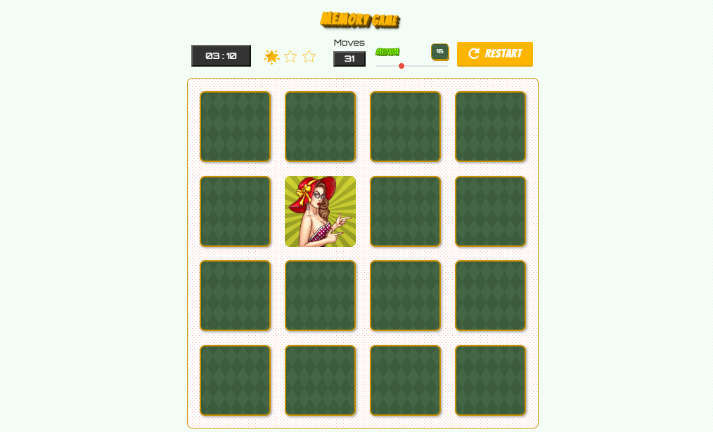

# Pop Art Memory Game

A project developed for Udacity Front End Developer Nanodegree.

## Details

Original project requirements can be found in [this pdf](memory-game-project-rubric.pdf), and starter repository [here](https://github.com/udacity/fend-project-memory-game).
The layout was rebuilt from scratch using custom SVG sprites and complex CSS/SVG transitions. Animation techniques should be considered experimental, rather as proof of concept, as their productivity is pretty low.

## Getting Started

* Clone repo, install node  modules
* Run `gulp build`

Node.js is required

## Game Features

The game board consists of control panel and main area where the cards, shuffled randomly, are located. The player is able to flip the card by clicking it. The task is to find all matching pairs at the less possible flips and best possible time.

Game has 4 levels, which are different by amount of cards on the deck:
* _"Easy"_ - 12 cards;
* _"Medium"_ - 16 cards;
* _"Hard"_ - 20 cards;
* _"Impossible"_ (not really) - 24 cards.

Control panel elements show your stats and let you manipulate the game:
* **Timer** - starts when you flip the first card and stops when you win the game
* **Star rating** - evaluates your game progress - the number of stars will decrease when you reach 24, 30 and 36 moves. The goal is to keep as much stars as possible.
* **Moves counter** - displays the amount of cards you flipped.
* **Level slider** - allows you to choose the game level. In case the game was started already, the modal pops up, asking to confirm if you wish to start a new game.
* **Restart button** - Start new game at the same level, if you're bored of the current one.

At the end of the game a modal popup shown, displaying all your stats.

## Built with
* Pug
* SASS (imports .json data through [Json-Importer](https://github.com/Updater/node-sass-json-importer))
* Gulp
* SVG
* HTML5 Dialog polyfill
* 🖤

## Screenshots

## Authors

* **[Irina Illustrova](https://github.com/Illustrova)**